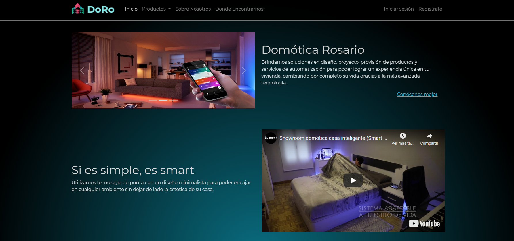

# Dómotica Rosario - CoderHouse - Desarrollo Web

## Proyecto final del curso Desarro Web

### Lenguajes: HTML CSS SASS

### Framework: BOOTSTRAP

### Autor: Suarez Barraza, Ignacio

#### Description: Página de domótica estática.

#### Link: https://ignaciosuarezb.github.io/DoRo-CoderHouse/

